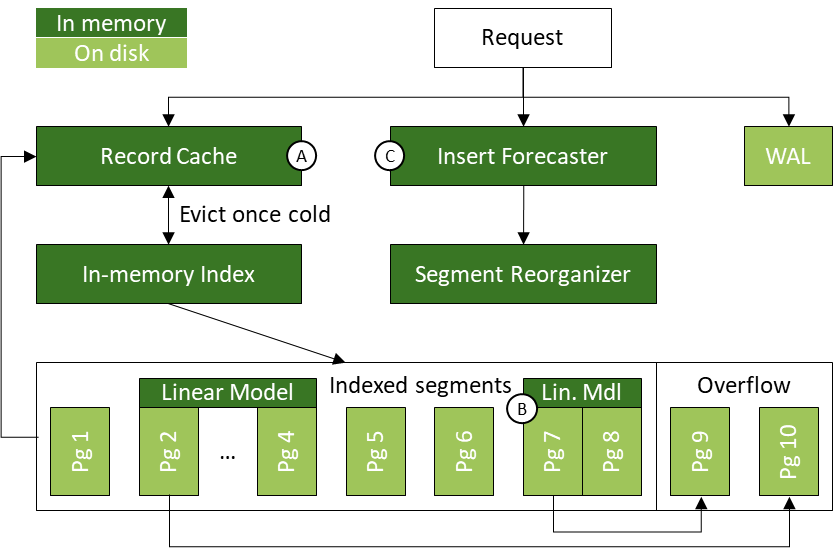

## LSMs and Modern NVMe SSDs: Still the Best Combination?

Many modern key-value stores, such as RocksDB and LevelDB, rely on
log-structured merge trees (LSMs). Originally designed for spinning disks, LSMs
optimize for write performance by only making sequential writes. But this
optimization comes at the cost of reads: LSMs must rely on expensive compaction
jobs and Bloom filters—all to maintain reasonable read performance. For
traditional disks (e.g., HDDs and SATA SSDs), this write versus read performance
trade-off has been the preferred choice. Random writes on traditional disks are
prohibitively expensive, and so any design that minimizes the amount of random
writes outshines the competition. But is this trade-off still the right one for
modern storage devices?

We observe that NVMe SSDs no longer suffer the same significant random write
drawback as traditional disks. With enough request parallelism, NVMe SSDs can
achieve their peak sequential write throughput through random writes. This
naturally leads us to a research question: how should a persistent key-value
store’s design change for NVMe SSDs where random writes are comparable to
sequential writes in performance?

## Revisit Update-in-Place?

We believe that update-in-place designs can be the answer for larger-than-memory
workloads that are (i) read-heavy, or (ii) skewed write-heavy. Update-in-place
designs, such as a classical disk-based B+ tree, offer excellent read
performance because each record is stored in a single location on disk—requiring
only one I/O to read (when inner nodes are cached in memory). High read
performance is desirable because read-heavy workloads such as caching or
analytics are common in practice.

However, classical disk-based B+ trees also suffer from their own challenges.
First, updating a single record on a page requires reading and writing the
entire page, which leads to write amplification. Second, scans can lead to
random reads because logically consecutive leaf pages are not necessarily stored
sequentially on disk; on NVMe SSDs, we observe that random reads still
underperform sequential reads. Third, inserts also cause write amplification
because of the need to “make space” in the on-disk structure to hold the new
records.

## TreeLine to the Rescue!

 
<strong>Figure 1:</strong> TreeLine's design, highlighting our key ideas. See
Sections 3 and 4 in <a href="https://www.vldb.org/pvldb/vol16/p99-yu.pdf">our
paper</a> for more details.

In this project, we develop a new design for NVMe SSDs that has the read
benefits of a classical update-in-place design while also mitigating its
traditional write drawbacks. In other words, observing that the fast random I/O
of NVMe SSDs would be favorable for an update-in-place design, we propose
techniques to make such a design competitive across the board. Our new design
leverages three complementary techniques: (A) record caching to reduce
read/write amplification in skewed workloads, (B) page grouping to translate
scans into sequential reads, and (C) insert forecasting to reduce the I/O needed
to “make space” for new records. We implement these techniques in TreeLine, a
new update-in-place key-value store designed for NVMe SSDs.

TreeLine buffers all writes in its record cache (key idea A), allowing it to (i)
keep hot records in memory for as long as possible, and (ii) batch writes that
go to the same on-disk page to amortize the I/O costs for updating a page.
Instead of laying out pages randomly on disk, TreeLine uses linear models to
group pages storing adjacent key ranges so that they are stored contiguously on
disk (key idea B). Doing so lets TreeLine (i) make long physical reads
(benefitting scans), while (ii) still allowing it to access data at page
granularity for point reads. Linear models help TreeLine realize these benefits
with a small in-memory index as it only needs to index the page group boundaries
(instead of every page boundary). Finally, to reduce the cost of inserts in an
update-in-place design, TreeLine exploits the repetitiveness in skewed insert
workloads to forecast the location and volume of inserts it expects to receive
(key idea C). It uses the forecast to leave appropriate space in its on-disk
pages to reduce how frequently it needs to reorganize its on-disk pages to
accommodate the new records. TreeLine tracks the inserts observed across
different parts of the key space and extrapolates these trends forward.

We evaluate TreeLine on YCSB using synthetic and real-world datasets. We compare
TreeLine against (i) RocksDB, a widely-used LSM key-value store, and (ii)
LeanStore, a state- of-the-art update-in-place key-value store. Across our point
YCSB workloads with 1024 byte records, TreeLine outperforms RocksDB and
LeanStore by 2.20x and 2.07x respectively on average. Although TreeLine makes
random reads from disk, we find that it still outperforms RocksDB and LeanStore
by 2.50x and 2.80x respectively with 16 threads on uniform scan-heavy workloads.

## Read the Paper

[Geoffrey X. Yu*, Markos Markakis*, Andreas Kipf*, Per-Åke Larson, Umar Farooq
Minhas, Tim Kraska. TreeLine: An Update-In-Place Key-Value Store for Modern
Storage. PVLDB Volume 16 Issue 1, 2022.](https://www.vldb.org/pvldb/vol16/p99-yu.pdf)

* Denotes equal contribution.

## Project Participants

Andreas Kipf, Tim Kraska, Markos Markakis, Geoffrey Yu